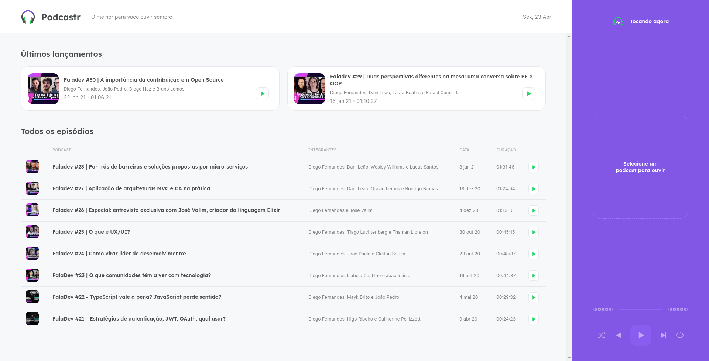
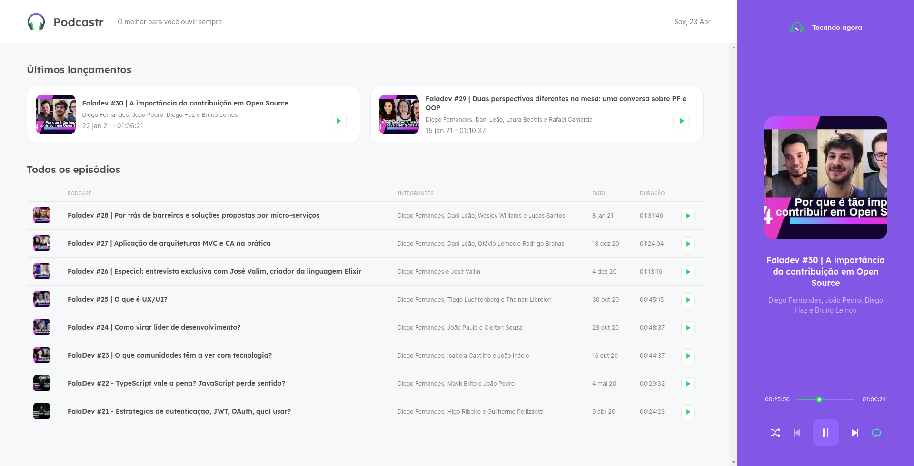
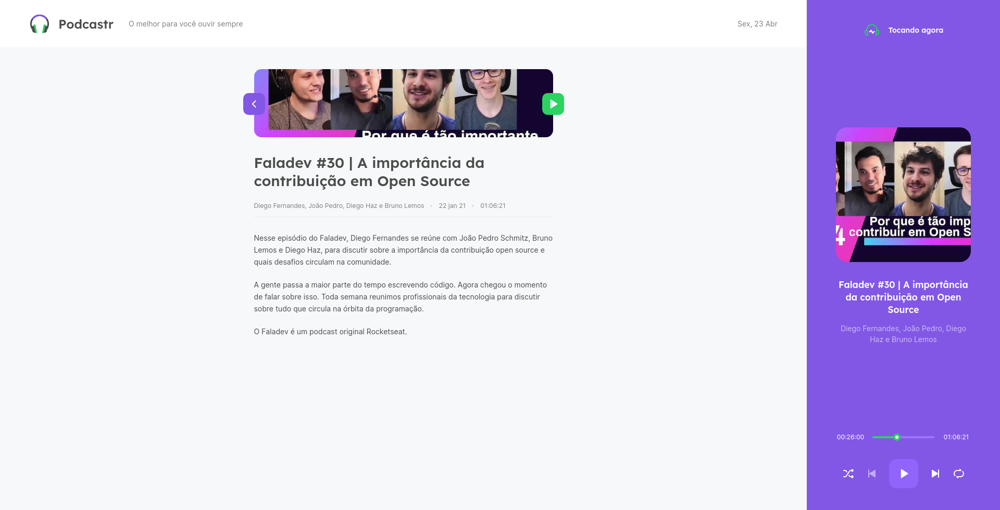
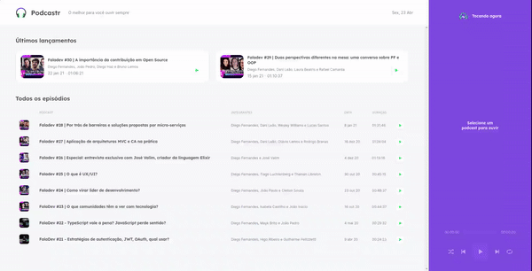

	
	
  
  
  <a href="https://github.com/caiofuccio">
	  
	<a/>
  

 

<h1  align="center">
  
</h1>
 

 <a href="#-sobre">Sobre</a> •
 <a href="#-funcionalidades">Funcionalidades</a> •
 <a href="#-layout">Layout</a> • 
 <a href="#-como-executar">Como executar</a> • 
 <a href="#-tecnologias">Tecnologias</a> • 
 <a href="#-autor">Autor</a> •
 <a href="#-licença">Licença</a>

 

<h4 align="center"> 
	🚧   Em construção (melhorias)   🚧
</h4>
 

---

## 💻 Sobre

O Podcastr é um web app para ancoragem de episódios de podcast com um player embutido, onde você pode ouvir seus episódios favoritos.

Essa aplicação foi feita utilizando React, Next.js, Typescript, Sass e o servidor utilizado é do tipo Fake API com JSON Server.

Ela foi construída durante a quinta edição do Next Level Week, oferecido pela Rocketseat, na trilha de React.

 

---

## ⚙️ Funcionalidades

A aplicação é do tipo Single Page Application (SPA) e conta com uma página home onde podem ser vistos os últimos episódios lançados, todos os episódios e conta com um player para reproduzir os episódios. Ao clicar em qualquer episódio você será redirecionado(a) à página de detalhes, que conta com a descrição detalhada do mesmo.

Na página Home você pode:

- Visualizar e selecionar episódios para ouvir
- Entrar na página dos episódios
- Ver informações como duração, participantes e data de publicação.

Na página de cada episódio você pode:

- Ver todas as informações apresentadas na home e a descrição do episódio em detalhes
- Reproduzir o episódios

No player, que sempre estará visível, você pode:

- Visualizar qual episódio está sendo reproduzido
- Dar play, pausar, avançar para o próximo episódio ou retroceder
- Alterar o tempo de reprodução a partir do Slider
- Selecionar o modo aleatório
- Selecionar a repetição do episódio

 

---

## 🖼️ Layout

 

 
 

  

 

---

## 🧰 Como executar

    # Clone o repositório
    $ git clone git@github.com:caiofuccio/podcastr.git

    # Instale as dependências
    $ yarn

    # Inicie a Fake API com JSON Server
    $ yarn server

    # Execute a aplicação
    $ yarn start

    # A aplicação será aberta na porta:3000 - acesse https://localhost:3000

 

---

## 🚀 Tecnologias

	
	
	 
	
	
   
  
  
  
	 

 

---

## 👨‍💻 Autor

	
	 
	<strong>Caio Fuccio</strong>
	 
	 Front-End Developer | ReactJS
	 
	 
	
	

 

---

## ⚖️ Licença

Este projeto está sob a licença MIT.

Acesse o arquivo de [LICENSE](./LICENSE) para mais informações.
